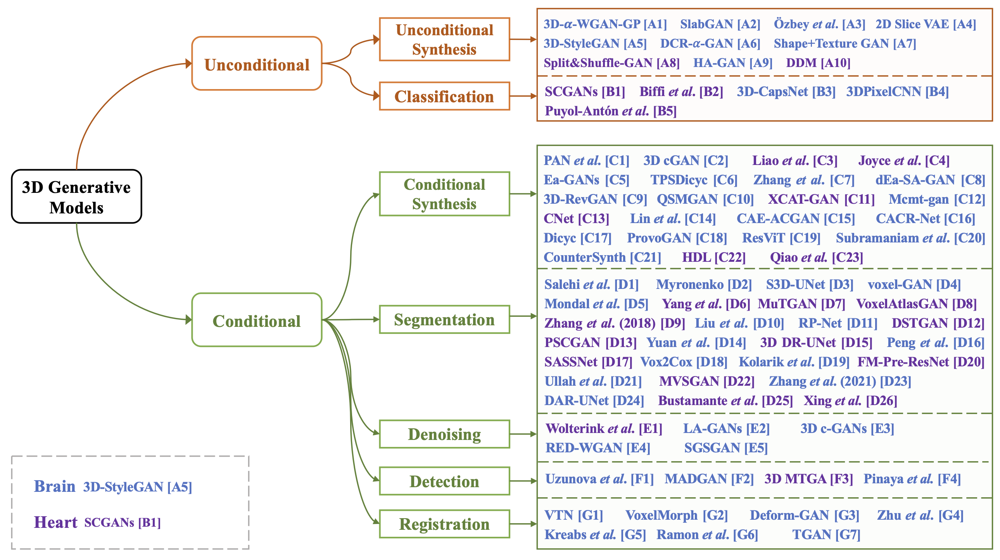

# This repo supplements our [3D Brain and Heart Volume Generative Models: A Survey](https://arxiv.org/abs/2210.05952)
Yanbin Liu, Girish Dwivedi, Farid Boussaid, Mohammed Bennamoun

This repo includes all the 3D Brain and Heart Volume Generative Models papers which are presented in our [paper](https://arxiv.org/pdf/2210.05952.pdf), and we aim to update this repo frequently.

<p align="center">

</p>

## Content
- ### [Unconditional Applications](#unconditional-applications)<br>
  - [Unconditional Synthesis](#unconditional-synthesis)<br>
  - [Classification](#classification)<br>
- ### [Conditional Applications](#conditional-applications-1)<br>
  - [Conditional Synthesis](#conditional-synthesis)<br>
  - [Segmentation](#segmentation)<br>
  - [Denoising](#denoising)<br>
  - [Detection](#detection)<br>
  - [Registration](#registration)<br>


# Unconditional Applications

## Unconditional Synthesis

[A1] (3D-𝛼-WGAN-GP) Gihyun Kwon, Chihye Han, and Dae-shik Kim. 2019. Generation of 3D brain MRI using auto-encoding generative adversarial networks. In International Conference on Medical Image Computing and Computer-Assisted Intervention. Springer, 118–126.

[A2] (SlabGAN) Jason L Granstedt, Varun A Kelkar, Weimin Zhou, and Mark A Anastasio. 2021. SlabGAN: a method for generating efficient 3D anisotropic medical volumes using generative adversarial networks. In Medical Imaging 2021: Image Processing, Vol. 11596. SPIE, 329–335.

[A3] (Özbey et al.) Muzaffer Özbey, Mahmut Yurt, Salman Ul Hassan Dar, and Tolga Çukur. 2020. Three dimensional mr image synthesis with progressive generative adversarial networks. arXiv preprint arXiv:2101.05218 (2020).

[A4] (2D Slice VAE) Anna Volokitin, Ertunc Erdil, Neerav Karani, Kerem Can Tezcan, Xiaoran Chen, Luc Van Gool, and Ender Konukoglu. 2020. Modelling the distribution of 3D brain MRI using a 2D slice VAE. In International Conference on Medical Image Computing and Computer-Assisted Intervention. Springer, 657–666.

[A5] (3D StyleGAN) Sungmin Hong, Razvan Marinescu, Adrian V Dalca, Anna K Bonkhoff, Martin Bretzner, Natalia S Rost, and Polina Golland. 2021. 3d-stylegan: A style-based generative adversarial network for generative modeling of three-dimensional medical images. In Deep Generative Models, and Data Augmentation, Labelling, and Imperfections. Springer, 24–34.

[A6] (DCR-𝛼-GAN) Alice Segato, Valentina Corbetta, Marco Di Marzo, Luca Pozzi, and Elena De Momi. 2020. Data augmentation of 3D brain environment using deep convolutional refined auto-encoding alpha GAN. IEEE Transactions on Medical Robotics and Bionics 3, 1 (2020), 269–272.

[A7] (Shape+Texture GAN) Chee Keong Chong and Eric Tatt Wei Ho. 2021. Synthesis of 3D MRI brain images with shape and texture generative adversarial deep neural networks. IEEE Access 9 (2021), 64747–64760.

[A8] (Split&Shuffle-GAN) Yanbin Liu, Girish Dwivedi, Farid Boussaid, Frank Sanfilippo, Makoto Yamada, and Mohammed Bennamoun. 2022. Inflating 2D Convolution Weights for Efficient Generation of 3D Medical Images. Computer Methods and Programs in Biomedicine (2023), 107685.

[A9] (HA-GAN) Li Sun, Junxiang Chen, Yanwu Xu, Mingming Gong, Ke Yu, and Kayhan Batmanghelich. 2022. Hierarchical Amortized GAN for 3D High Resolution Medical Image Synthesis. IEEE Journal of Biomedical and Health Informatics 26, 8 (2022), 3966–3975.

[A10] (DDM) Boah Kim and Jong Chul Ye. 2022. Diffusion Deformable Model for 4D Temporal Medical Image Generation. arXiv preprint arXiv:2206.13295 (2022).


## Classification

[B1] (SCGANs) Le Zhang, Ali Gooya, and Alejandro F Frangi. 2017. Semi-supervised assessment of incomplete LV coverage in cardiac MRI using generative adversarial nets. In International workshop on simulation and synthesis in medical imaging. Springer, 61–68.

[B2] (Biffi et al.) Carlo Biffi, Ozan Oktay, Giacomo Tarroni, Wenjia Bai, Antonio De Marvao, Georgia Doumou, Martin Rajchl, Reem Bedair, Sanjay Prasad, Stuart Cook, et al. 2018. Learning interpretable anatomical features through deep generative models: Application to cardiac remodeling. In International conference on medical image computing and computer- assisted intervention. Springer, 464–471.

[B3] (3D-CapsNet) KR Kruthika, HD Maheshappa, Alzheimer’s Disease Neuroimaging Initiative, et al. 2019. CBIR system using Capsule Networks and 3D CNN for Alzheimer’s disease diagnosis. Informatics in Medicine Unlocked 14 (2019), 59–68.

[B4] (3DPixelCNN) Guilherme Pombo, Robert Gray, Thomas Varsavsky, John Ashburner, and Parashkev Nachev. 2019. Bayesian Volumetric Autoregressive generative models for better semisupervised learning. In International Conference on Medical Image Computing and Computer-Assisted Intervention. Springer, 429–437.

[B5] (Puyol-Antón et al.) Esther Puyol-Antón, Chen Chen, James R Clough, Bram Ruijsink, Baldeep S Sidhu, Justin Gould, Bradley Porter, Marc Elliott, Vishal Mehta, Daniel Rueckert, et al. 2020. Interpretable deep models for cardiac resynchronisation therapy response prediction. In International Conference on Medical Image Computing and Computer-Assisted Intervention. Springer, 284–293.


<h1 id="conditional-applications-1">Conditional Applications</h1>

## Conditional Synthesis

[C1] (PAN et al.) Yongsheng Pan, Mingxia Liu, Chunfeng Lian, Tao Zhou, Yong Xia, and Dinggang Shen. 2018. Synthesizing missing PET from MRI with cycle-consistent generative adversarial networks for Alzheimer’s disease diagnosis. In International conference on medical image computing and computer-assisted intervention. Springer, 455–463.

[C2] (3D cGAN) Biting Yu, Luping Zhou, Lei Wang, Jurgen Fripp, and Pierrick Bourgeat. 2018. 3D cGAN based cross-modality MR image synthesis for brain tumor segmentation. In 2018 IEEE 15th international symposium on biomedical imaging (ISBI 2018). IEEE, 626–630.

[C3] (Liao et al.) Haofu Liao, Yucheng Tang, Gareth Funka-Lea, Jiebo Luo, and Shaohua Kevin Zhou. 2018. More knowledge is better: Cross-modality volume completion and 3D+ 2D segmentation for intracardiac echocardiography contouring. In International Conference on Medical Image Computing and Computer-Assisted Intervention. Springer, 535–543.

[C4] (Joyce et al.) Thomas Joyce and Sebastian Kozerke. 2019. 3D medical image synthesis by factorised representation and deformable model learning. In International Workshop on Simulation and Synthesis in Medical Imaging. Springer, 110–119.

[C5] (Ea-GANs) Biting Yu, Luping Zhou, Lei Wang, Yinghuan Shi, Jurgen Fripp, and Pierrick Bourgeat. 2019. Ea-GANs: edge-aware generative adversarial networks for cross-modality MR image synthesis. IEEE transactions on medical imaging 38, 7 (2019), 1750–1762.

[C6] (TPSDicyc) Chengjia Wang, Giorgos Papanastasiou, Sotirios Tsaftaris, Guang Yang, Calum Gray, David Newby, Gillian Macnaught, and Tom MacGillivray. 2019. TPSDicyc: Improved deformation invariant cross-domain medical image synthesis. In Machine Learning for Medical Image Reconstruction: Second International Workshop, MLMIR 2019, Held in Conjunction with MICCAI 2019, Shenzhen, China, October 17, 2019, Proceedings 2. Springer, 245–254. 

[C7] (Zhang et al.) Zhang Hongtao, Yuki Shinomiya, and Shinichi Yoshida. 2020. 3D brain MRI reconstruction based on 2D super- resolution technology. In 2020 IEEE international conference on systems, man, and cybernetics (SMC). IEEE, 18–23.

[C8] (dEa-SA-GAN) Biting Yu, Luping Zhou, Lei Wang, Yinghuan Shi, Jurgen Fripp, and Pierrick Bourgeat. 2020. Sample-adaptive gans: Linking global and local mappings for cross-modality mr image synthesis. IEEE transactions on medical imaging 39, 7 (2020), 2339–2350.

[C9] (3D-RevGAN) Wanyun Lin. 2020. Synthesizing missing data using 3D reversible GAN for alzheimer’s disease. In Proceedings of the 2020 international symposium on artificial intelligence in medical sciences. 208–213.

[C10] (QSMGAN) Yicheng Chen, Angela Jakary, Sivakami Avadiappan, Christopher P Hess, and Janine M Lupo. 2020. QSMGAN: improved quantitative susceptibility mapping using 3D generative adversarial networks with increased receptive field. NeuroImage 207 (2020), 116389.

[C11] (XCAT-GAN) Sina Amirrajab, Samaneh Abbasi-Sureshjani, Yasmina Al Khalil, Cristian Lorenz, Juergen Weese, Josien Pluim, and Marcel Breeuwer. 2020. Xcat-gan for synthesizing 3d consistent labeled cardiac mr images on anatomically variable xcat phantoms. In International Conference on Medical Image Computing and Computer-Assisted Intervention. Springer, 128–137.

[C12] (Mcmt-gan) Yawen Huang, Feng Zheng, Runmin Cong, Weilin Huang, Matthew R Scott, and Ling Shao. 2020. Mcmt-gan: multi-task coherent modality transferable gan for 3d brain image synthesis. IEEE Transactions on Image Processing 29 (2020), 8187–8198.

[C13] (CNet) Hossam El-Rewaidy, Ulf Neisius, Jennifer Mancio, Selcuk Kucukseymen, Jennifer Rodriguez, Amanda Paskavitz, Bjoern Menze, and Reza Nezafat. 2020. Deep complex convolutional network for fast reconstruction of 3D late gadolinium enhancement cardiac MRI. NMR in Biomedicine 33, 7 (2020), e4312.

[C14] (Lin et al.) Wanyun Lin, Weiming Lin, Gang Chen, Hejun Zhang, Qinquan Gao, Yechong Huang, Tong Tong, Min Du, and Alzheimer’s Disease Neuroimaging Initiative. 2021. Bidirectional mapping of brain MRI and PET with 3D reversible GAN for the diagnosis of Alzheimer’s disease. Frontiers in Neuroscience 15 (2021), 646013.

[C15] (CAE-ACGAN) Huan Yang, Xianling Lu, Shui-Hua Wang, Zhihai Lu, Jian Yao, Yizhang Jiang, and Pengjiang Qian. 2021. Synthesizing multi-contrast MR images via novel 3D conditional Variational auto-encoding GAN. Mobile Networks and Applications 26, 1 (2021), 415–424.

[C16] (CACR-Net) Bo Peng, Bingzheng Liu, Yi Bin, Lili Shen, and Jianjun Lei. 2021. Multi-Modality MR Image Synthesis via Confidence- Guided Aggregation and Cross-Modality Refinement. IEEE Journal of Biomedical and Health Informatics 26, 1 (2021), 27–35.

[C17] (Dicyc) Chengjia Wang, Guang Yang, Giorgos Papanastasiou, Sotirios A Tsaftaris, David E Newby, Calum Gray, Gillian Macnaught, and Tom J MacGillivray. 2021. DiCyc: GAN-based deformation invariant cross-domain information fusion for medical image synthesis. Information Fusion 67 (2021), 147–160.

[C18] (ProvoGAN) Mahmut Yurt, Muzaffer Özbey, Salman UH Dar, Berk Tinaz, Kader K Oguz, and Tolga Çukur. 2022. Progressively volumetrized deep generative models for data-efficient contextual learning of MR image recovery. Medical Image Analysis 78 (2022), 102429.

[C19] (ResViT) Onat Dalmaz, Mahmut Yurt, and Tolga Çukur. 2021. ResViT: Residual vision transformers for multi-modal medical image synthesis. arXiv preprint arXiv:2106.16031 (2021).

[C20] (Subramaniam et al.) Pooja Subramaniam, Tabea Kossen, Kerstin Ritter, Anja Hennemuth, Kristian Hildebrand, Adam Hilbert, Jan Sobesky, Michelle Livne, Ivana Galinovic, Ahmed A Khalil, et al. 2022. Generating 3D TOF-MRA volumes and segmentation labels using generative adversarial networks. Medical Image Analysis 78 (2022), 102396.

[C21] (CounterSynth) Guilherme Pombo, Robert Gray, Jorge Cardoso, Sebastien Ourselin, Geraint Rees, John Ashburner, and Parashkev Nachev. 2021. Equitable modelling of brain imaging by counterfactual augmentation with morphologically constrained 3D deep generative models. arXiv preprint arXiv:2111.14923 (2021).

[C22] (HDL) Xiaodan Xing, Javier Del Ser, Yinzhe Wu, Yang Li, Jun Xia, Xu Lei, David Firmin, Peter Gatehouse, and Guang Yang. 2022. HDL: Hybrid Deep Learning for the Synthesis of Myocardial Velocity Maps in Digital Twins for Cardiac Analysis. IEEE Journal of Biomedical and Health Informatics (2022).

[C23] (Qiao et al.) Mengyun Qiao, Berke Doga Basaran, Huaqi Qiu, Shuo Wang, Yi Guo, Yuanyuan Wang, Paul M Matthews, Daniel Rueckert, and Wenjia Bai. 2022. Generative modelling of the ageing heart with cross-sectional imaging and clinical data. In International Workshop on Statistical Atlases and Computational Models of the Heart. Springer, 3–12.

## Segmentation

[D1] (Salehi et al.) Seyed Sadegh Mohseni Salehi, Deniz Erdogmus, and Ali Gholipour. 2017. Tversky loss function for image segmentation using 3D fully convolutional deep networks. In International workshop on machine learning in medical imaging. Springer, 379–387.

[D2] (Myronenko) Andriy Myronenko. 2018. 3D MRI brain tumor segmentation using autoencoder regularization. In International MICCAI Brainlesion Workshop. Springer, 311–320.

[D3] (S3D-UNet) Wei Chen, Boqiang Liu, Suting Peng, Jiawei Sun, and Xu Qiao. 2018. S3D-UNet: separable 3D U-Net for brain tumor segmentation. In International MICCAI Brainlesion Workshop. Springer, 358–368.

[D4] (voxel-GAN) Mina Rezaei, Haojin Yang, and Christoph Meinel. 2018. voxel-GAN: adversarial framework for learning imbalanced brain tumor segmentation. In International MICCAI Brainlesion Workshop. Springer, 321–333.

[D5] (Mondal et al.) Arnab Kumar Mondal, Jose Dolz, and Christian Desrosiers. 2018. Few-shot 3d multi-modal medical image segmentation using generative adversarial learning. arXiv preprint arXiv:1810.12241 (2018).

[D6] (Yang et al.) Dong Yang, Bo Liu, Leon Axel, and Dimitris Metaxas. 2018. 3d lv probabilistic segmentation in cardiac mri using generative adversarial network. In International Workshop on Statistical Atlases and Computational Models of the Heart. Springer, 181–190.

[D7] (MuTGAN) Chenchu Xu, Lei Xu, Gary Brahm, Heye Zhang, and Shuo Li. 2018. MuTGAN: simultaneous segmentation and quantification of myocardial infarction without contrast agents via joint adversarial learning. In International Conference on Medical Image Computing and Computer-Assisted Intervention. Springer, 525–534.

[D8] (VoxelAtlasGAN) Suyu Dong, Gongning Luo, Kuanquan Wang, Shaodong Cao, Ashley Mercado, Olga Shmuilovich, Henggui Zhang, and Shuo Li. 2018. VoxelAtlasGAN: 3D left ventricle segmentation on echocardiography with atlas guided generation and voxel-to-voxel discrimination. In International Conference on Medical Image Computing and Computer-Assisted Intervention. Springer, 622–629.

[D9] (Zhang et al.) Zizhao Zhang, Lin Yang, and Yefeng Zheng. 2018. Translating and segmenting multimodal medical volumes with cycle-and shape-consistency generative adversarial network. In Proceedings of the IEEE conference on computer vision and pattern Recognition. 9242–9251.

[D10] (Liu et al.) Jing Liu, Pengyu Yin, Xiaohui Wang, Wei Yang, and Kun Cheng. 2019. Glioma subregions segmentation with a discriminative adversarial regularized 3D Unet. In Proceedings of the Third International Symposium on Image Computing and Digital Medicine. 269–273.

[D11] (RP-Net) Liansheng Wang, Cong Xie, and Nianyin Zeng. 2019. RP-Net: a 3D convolutional neural network for brain segmenta- tion from magnetic resonance imaging. IEEE Access 7 (2019), 39670–39679.

[D12] (DSTGAN) Chenchu Xu, Joanne Howey, Pavlo Ohorodnyk, Mike Roth, Heye Zhang, and Shuo Li. 2020. Segmentation and quantification of infarction without contrast agents via spatiotemporal generative adversarial learning. Medical image analysis 59 (2020), 101568.

[D13] (PSCGAN) Chenchu Xu, Lei Xu, Pavlo Ohorodnyk, Mike Roth, Bo Chen, and Shuo Li. 2020. Contrast agent-free synthesis and segmentation of ischemic heart disease images using progressive sequential causal GANs. Medical image analysis 62 (2020), 101668.

[D14] (Yuan et al.) Wenguang Yuan, Jia Wei, Jiabing Wang, Qianli Ma, and Tolga Tasdizen. 2020. Unified generative adversarial networks for multimodal segmentation from unpaired 3D medical images. Medical Image Analysis 64 (2020), 101731.

[D15] (3D DR-UNet) Sulaiman Vesal, Andreas Maier, and Nishant Ravikumar. 2020. Fully automated 3d cardiac mri localisation and segmentation using deep neural networks. Journal of Imaging 6, 7 (2020), 65.

[D16] (Peng et al.) Suting Peng, Wei Chen, Jiawei Sun, and Boqiang Liu. 2020. Multi-scale 3d u-nets: an approach to automatic segmentation of brain tumor. International Journal of Imaging Systems and Technology 30, 1 (2020), 5–17.

[D17] (SASSNet) Shuailin Li, Chuyu Zhang, and Xuming He. 2020. Shape-aware semi-supervised 3D semantic segmentation for medical images. In International Conference on Medical Image Computing and Computer-Assisted Intervention. Springer, 552–561.

[D18] (Vox2Vox) Marco Domenico Cirillo, David Abramian, and Anders Eklund. 2020. Vox2Vox: 3D-GAN for brain tumour segmenta- tion. In International MICCAI Brainlesion Workshop. Springer, 274–284.

[D19] (Kolarik et al.) Martin Kolarik, Radim Burget, Carlos M Travieso-Gonzalez, and Jan Kocica. 2021. Planar 3D Transfer Learning for End to End Unimodal MRI Unbalanced Data Segmentation. In 2020 25th International Conference on Pattern Recognition (ICPR). IEEE, 6051–6058.

[D20] (FM-Pre-ResNet) Marija Habijan, Irena Galić, Hrvoje Leventić, and Krešimir Romić. 2021. Whole Heart Segmentation Using 3D FM-Pre-ResNet Encoder–Decoder Based Architecture with Variational Autoencoder Regularization. Applied Sciences 11, 9 (2021), 3912.

[D21] (Ullah et al.) Faizad Ullah, Shahab U Ansari, Muhammad Hanif, Mohamed Arselene Ayari, Muhammad Enamul Hoque Chowd- hury, Amith Abdullah Khandakar, and Muhammad Salman Khan. 2021. Brain MR image enhancement for tumor segmentation using 3D U-Net. Sensors 21, 22 (2021), 7528.

[D22] (MVSGAN) Xiaoming Qi, Yuting He, Guanyu Yang, Yang Chen, Jian Yang, Wangyag Liu, Yinsu Zhu, Yi Xu, Huazhong Shu, and Shuo Li. 2021. MVSGAN: Spatial-Aware Multi-View CMR Fusion for Accurate 3D Left Ventricular Myocardium Segmentation. IEEE Journal of Biomedical and Health Informatics 26, 5 (2021), 2264–2275.

[D23] (Zhang et al.) Dingwen Zhang, Guohai Huang, Qiang Zhang, Jungong Han, Junwei Han, and Yizhou Yu. 2021. Cross-modality deep feature learning for brain tumor segmentation. Pattern Recognition 110 (2021), 107562.

[D24] (DAR-UNet) Kai Yao, Zixian Su, Kaizhu Huang, Xi Yang, Jie Sun, Amir Hussain, and Frans Coenen. 2022. A novel 3D unsupervised domain adaptation framework for cross-modality medical image segmentation. IEEE Journal of Biomedical and Health Informatics (2022).

[D25] (Bustamante et al.) Mariana Bustamante, Federica Viola, Jan Engvall, Carl-Johan Carlhäll, and Tino Ebbers. 2022. Automatic Time-Resolved Cardiovascular Segmentation of 4D Flow MRI Using Deep Learning. Journal of Magnetic Resonance Imaging (2022).

[D26] (Xing et al.) Xiaodan Xing, Yinzhe Wu, David Firmin, Peter Gatehouse, and Guang Yang. 2022. Synthetic velocity mapping cardiac MRI coupled with automated left ventricle segmentation. In Medical Imaging 2022: Image Processing, Vol. 12032. SPIE, 781–785.

## Denoising

[E1] (Wolterink et al.) Jelmer M Wolterink, Tim Leiner, Max A Viergever, and Ivana Išgum. 2017. Generative adversarial networks for noise reduction in low-dose CT. IEEE transactions on medical imaging 36, 12 (2017), 2536–2545.

[E2] (LA-GANs) Yan Wang, Luping Zhou, Biting Yu, Lei Wang, Chen Zu, David S Lalush, Weili Lin, Xi Wu, Jiliu Zhou, and Dinggang Shen. 2018. 3D auto-context-based locality adaptive multi-modality GANs for PET synthesis. IEEE transactions on medical imaging 38, 6 (2018), 1328–1339.

[E3] (3D c-GANs) Yan Wang, Biting Yu, Lei Wang, Chen Zu, David S Lalush, Weili Lin, Xi Wu, Jiliu Zhou, Dinggang Shen, and Luping Zhou. 2018. 3D conditional generative adversarial networks for high-quality PET image estimation at low dose. Neuroimage 174 (2018), 550–562.

[E4] (RED-WGAN) Maosong Ran, Jinrong Hu, Yang Chen, Hu Chen, Huaiqiang Sun, Jiliu Zhou, and Yi Zhang. 2019. Denoising of 3D magnetic resonance images using a residual encoder-decoder Wasserstein generative adversarial network. Medical image analysis 55 (2019), 165–180.

[E5] (SGSGAN) Yang Zhou, Zhiwen Yang, Hui Zhang, I Eric, Chao Chang, Yubo Fan, and Yan Xu. 2022. 3D Segmentation Guided Style-based Generative Adversarial Networks for PET Synthesis. IEEE Transactions on Medical Imaging (2022).


## Detection

[F1] (Uzunova et al.) Hristina Uzunova, Sandra Schultz, Heinz Handels, and Jan Ehrhardt. 2019. Unsupervised pathology detection in medical images using conditional variational autoencoders. International journal of computer assisted radiology and surgery 14, 3 (2019), 451–461.

[F2] (MADGAN) Changhee Han, Leonardo Rundo, Kohei Murao, Tomoyuki Noguchi, Yuki Shimahara, Zoltán Ádám Milacski, Saori Koshino, Evis Sala, Hideki Nakayama, and Shin’ichi Satoh. 2021. MADGAN: Unsupervised medical anomaly detection GAN using multiple adjacent brain MRI slice reconstruction. BMC bioinformatics 22, 2 (2021), 1–20.

[F3] (3D MTGA) Xiangyu Xiong, Yan Ding, Chuanqi Sun, Zhuoneng Zhang, Xiuhong Guan, Tianjing Zhang, Hao Chen, Hongyan Liu, Zhangbo Cheng, Lei Zhao, et al. 2022. A Cascaded Multi-Task Generative Framework for Detecting Aortic Dissection on 3D Non-contrast-enhanced Computed Tomography. IEEE Journal of Biomedical and Health Informatics (2022).

[F4] (Pinaya et al.) Walter HL Pinaya, Petru-Daniel Tudosiu, Robert Gray, Geraint Rees, Parashkev Nachev, Sebastien Ourselin, and M Jorge Cardoso. 2022. Unsupervised brain imaging 3D anomaly detection and segmentation with transformers. Medical Image Analysis 79 (2022), 102475.


## Registration

[G1] (VTN) Shengyu Zhao, Tingfung Lau, Ji Luo, I Eric, Chao Chang, and Yan Xu. 2019. Unsupervised 3D end-to-end medical image registration with volume tweening network. IEEE journal of biomedical and health informatics 24, 5 (2019), 1394–1404.

[G2] (VoxelMorph) Guha Balakrishnan, Amy Zhao, Mert R Sabuncu, John Guttag, and Adrian V Dalca. 2019. VoxelMorph: a learning framework for deformable medical image registration. IEEE transactions on medical imaging 38, 8 (2019), 1788–1800.

[G3] (Deform-GAN) Xiaoyue Zhang, Weijian Jian, Yu Chen, and Shihting Yang. 2020. Deform-GAN: an unsupervised learning model for deformable registration. arXiv preprint arXiv:2002.11430 (2020).

[G4] (Zhu et al.) Zhenyu Zhu, Yiqin Cao, Chenchen Qin, Yi Rao, Di Lin, Qi Dou, Dong Ni, and Yi Wang. 2021. Joint affine and deformable three-dimensional networks for brain MRI registration. Medical Physics 48, 3 (2021), 1182–1196.

[G5] (Krebs et al.) Julian Krebs,Hervé Delingette,Nicholas Ayache, and Tommaso Mansi. 2021. Learning a generative motion model from image sequences based on a latent motion matrix. IEEE Transactions on Medical Imaging 40, 5 (2021), 1405–1416.

[G6] (Ramon et al.) Ubaldo Ramon, Monica Hernandez, and Elvira Mayordomo. 2022. LDDMM meets GANs: Generative Adversarial Networks for diffeomorphic registration. In International Workshop on Biomedical Image Registration. Springer, 18–28.

[G7] (TGAN) Xingxing Zhu, Zhiwen Huang, Mingyue Ding, and Xuming Zhang. 2022. Non-rigid multi-modal brain image registration based on two-stage generative adversarial nets. Neurocomputing 505 (2022), 44–57.


# Citation

If you find the listing or the survey useful for your work, please cite our paper:

```
@misc{Liu2022,
      title={3D Brain and Heart Volume Generative Models: A Survey}, 
      author={Liu, Yanbin and Dwivedi, Girish and Boussaid, Farid and Bennamoun, Mohammed},
      year={2022},
      eprint={2210.05952},
      archivePrefix={arXiv},
      primaryClass={eess.IV}
}
}
